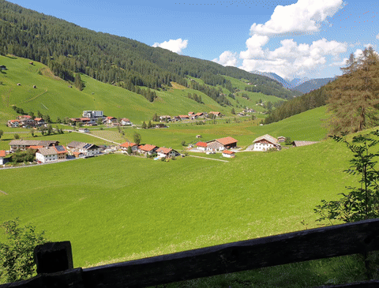
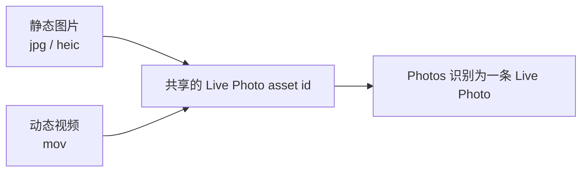
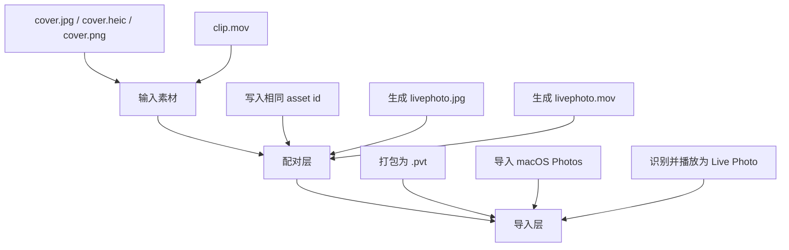
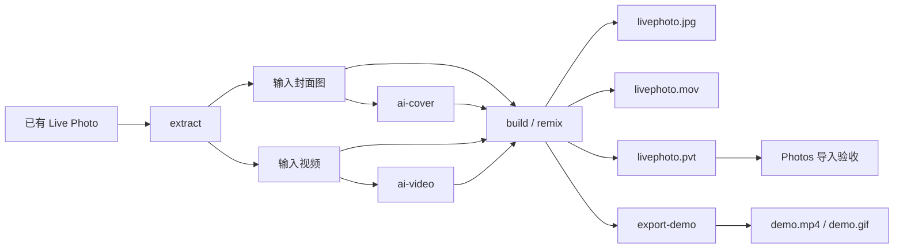

如果你在朋友圈里看到一张很像海报的静态图，长按之后却突然动了起来，而且播放的是另一段完全不同的视频，这种“表里不一”的体验其实很有意思。

先看一个这次真实跑出来的例子：



如果把组合方式反过来，也可以得到另一种观感：封面变成风格化插画，长按后播放原始视频。


我做 `isekai-live` 这个小工具，最初不是为了研究“怎么拍一张 Live Photo”，而是为了研究另一件事：能不能把 Live Photo 的封面和动态内容彻底解耦，让一张图和一段视频自由组合。

比如：

- 用一张 AI 图做封面，长按后播放真人自拍视频
- 用一张修复后的老照片做封面，长按后播放家人说话的视频
- 用一张宠物拟人插画做封面，长按后播放宠物真实片段

从内容传播的角度看，这比“做一张会动的照片”更有趣，因为它让预览和展开之间出现了反差。

这组演示不是示意图，而是我实际跑出来的一条链路：

- 保留原图作为封面
- 把原始视频做成动漫风格视频
- 最后把两者重新打包成一条可导入 Photos 的 Live Photo

对应的命令大概是这样：

```bash
isekai-live ai-video \
  --input-video test.mov \
  --style anime \
  --provider qwen \
  --qwen-key YOUR_DASHSCOPE_API_KEY \
  --output stylized.mp4

isekai-live build \
  --cover test.jpeg \
  --video stylized.mp4 \
  --output-dir output

open output/livephoto.pvt
```

但顺着这个思路往下走，很快就会遇到一个问题：

Live Photo 到底是什么？它真的只是“一张图加一段视频”吗？

答案没那么简单。

## 这件事为什么值得做

大多数 Live Photo 工具解决的是“怎么做出一张会动的照片”。

而我更关心的是：

- 能不能主动指定封面，而不是被动接受视频中的某一帧
- 能不能把现有 Live Photo 提取出来，再换一张封面重新打包
- 能不能把 AI 图生图流程接进来，形成一个可重复试素材的闭环

从这个角度看，`isekai-live` 想解决的不是拍摄问题，而是工作流问题。

也正因为如此，它不是一个大而全的编辑器，也不是一个视频工作站。它更像一个很小的 CLI 胶水层，把几件原本分散的事串了起来。

## Live Photo 不是一个文件，而是一组配对资产

如果只站在用户视角，Live Photo 看起来像一张照片。

但从工程实现的角度看，它更像是一组被 Photos 识别为同一条资产的配对文件。

最直观的理解方式是：



也就是说：

- 静态图片负责封面和静态预览
- 短视频负责长按后的动态内容
- 两者还必须共享同一组关联标识，Photos 才会把它们当成一条 Live Photo

这也是为什么“把一张图和一段视频放到同一个文件夹里”并不会自动得到 Live Photo。

## 从工程角度看，Live Photo 至少有三层

如果把这件事再拆开一点，我会把它理解成三层：



这三层分别对应三件事：

- 你准备什么素材
- 这些素材怎样被写成一组可识别的资产
- 它们最终能不能被 Photos 接受

这里面最容易被忽略的是最后一层。

很多人看到本地已经生成了图片和视频，就觉得已经结束了。但对于 Live Photo 来说，真正的裁判不是你的 CLI，而是 Photos。

## 为什么 `.pvt` 很重要

如果你只研究图片和视频是否共享同一组标识，那到“配对层”就差不多了。

但如果你的目标是把结果重新导回 Apple Photos，事情就不一样了。你还需要一个更适合导入的包。

在 `makelive` 这条链路里，这个角色就是 `.pvt`。

它的重要性在于：

- 它让导入路径更明确
- 它让手动验收更直接
- 它把“生成成功”和“被 Photos 接受”这两件事连了起来

所以从实践角度看，一个完整的构建结果通常不只是两份文件，而是三份：

- `livephoto.jpg`
- `livephoto.mov`
- `livephoto.pvt`

## 为什么最终验证必须靠 Photos 导入

这件事是我在做工具时最早确定下来的边界之一。

验证其实要分两层。

### 第一层：资产层验证

这一层验证的是“从工程角度看，输出是不是合理”。

可以检查的内容包括：

- 是否生成了 `livephoto.jpg`、`livephoto.mov`、`livephoto.pvt`
- 图片和视频是否共享同一个 Live Photo 标识
- `extract` 能不能再把结果反向提取出来

这些都适合做自动化测试。

### 第二层：Photos 层验证

这一层验证的是“Apple 生态会不会把它当成真的 Live Photo”。

可以检查的内容包括：

- `.pvt` 能不能被 macOS Photos 导入
- 导入后是否显示为 Live Photo
- 长按或播放时，动态内容是否真的工作

这一层不能被“命令跑完了”替代。

原因很简单：

- 生成成功不等于可导入
- 可导入不等于播放正确
- 播放正确才算这条工作流真正闭环

这也是为什么我后来觉得，README 和博客里都应该把这件事写得很明确。不然别人会以为只要文件落盘了，问题就已经解决。

## `isekai-live` 的实现思路

基于前面的理解，这个项目没有必要做成一个很重的系统。更合理的方式是把路径收敛成几个非常直观的命令。

我最后保留的是这几个动作：

- `build`
- `extract`
- `remix`
- `ai-cover`
- `ai-video`
- `export-demo`

它们大致组成这样一条流程：



这个设计对我来说有几个好处：

- 它足够短，很容易理解
- `extract -> ai-cover -> remix` 可以形成自然闭环
- 每一步都能单独验证
- 不管是手动跑，还是后面接脚本，都比较顺手
- 还可以直接把结果导出成适合 README 和博客展示的演示素材

放到代码里，它其实也是很简单的几个模块：

- `cli.py`：命令行入口和参数分发
- `live_photo.py`：构建、提取、重混 Live Photo 资产
- `ai_cover.py`：AI 封面生成
- `ai_video.py`：AI 视频风格化
- `demo_media.py`：把封面图 + 视频导出成演示 mp4 / gif

我没有为了“看起来专业”去做很重的分层，因为这个项目的价值不在于架构表演，而在于把工作流尽量压短。

## 底层为什么直接用 `makelive`

这里我没有重复造轮子。

Live Photo 的元数据写入和 `.pvt` 打包，本来就已经有成熟的开源工具在做，这个项目直接复用了 [`makelive`](https://github.com/RhetTbull/makelive)。

我反而觉得这一点应该主动写清楚，而不是回避。

因为 `isekai-live` 真正提供的价值不是“从零发明了 Live Photo 的底层实现”，而是：

- 把底层能力做成了清晰的 CLI 工作流
- 补齐了 `build / extract / remix` 这条迭代路径
- 把 AI 封面生成顺畅地接回了 Live Photo 打包流程

对开源项目来说，边界说清楚，比刻意把自己包装得无所不能更重要。

## 一个很具体的坑：AI 封面生成成功，不等于能直接打包

这次在接 Qwen 图生图时，我遇到的一个很具体的问题是：

- Qwen 经常生成 `png`
- 但底层打包链路对照片侧输入更适合 `jpeg` / `heic`

如果不处理这一层，AI 封面虽然已经生成成功，后面的 Live Photo 打包却还是会失败。

这类问题很典型，也正好说明了工作流工具的价值经常不在“调用了一个模型 API”，而在于把这些跨边界的小问题抹平：

- 生成成功不等于可打包
- 可打包不等于可导入
- 可导入不等于最终体验正确

所以后来这个工具里的处理是：

- `ai-cover` 允许输出 `png`
- 但在 `build` / `remix` 时，如果封面是 `png`，就自动转成 `jpeg`

从代码层面看，这不是一个很大的特性；但从使用体验上看，它能明显降低心智负担。

## 如果你要自己试，最值得保留的是“可验证的闭环”

一个比较稳妥的流程是这样的：

```bash
# 1. 构建
isekai-live build --cover cover.jpg --video clip.mov --output-dir output

# 2. 检查输出
ls output

# 3. 导入 Photos
open output/livephoto.pvt
```

然后再在 Photos 里确认：

- 它是否被识别为 Live Photo
- 封面是否正确
- 长按后播放的动态内容是否正确

如果你要走 AI 工作流，大致也就是：

```bash
isekai-live extract --input original.jpg --output-dir assets/

isekai-live ai-cover \
  --input assets/cover.jpg \
  --prompt "把这张照片改成高质量卡通插画风格，保留主体构图与姿态，颜色明快，细节干净，适合做 Live Photo 封面" \
  --provider qwen \
  --qwen-key YOUR_DASHSCOPE_API_KEY \
  --output ai_cover.png

isekai-live remix \
  --input original.jpg \
  --new-cover ai_cover.png \
  --output-dir remixed/

open remixed/livephoto.pvt
```

这条路径对我来说最重要的不是“酷”，而是它真的形成了一个很短的可验证闭环。

同理，另一条路径也成立：

```bash
isekai-live ai-cover \
  --input test.jpeg \
  --prompt "把这张照片改成高质量卡通插画风格，保留主体构图与姿态，颜色明快，细节干净" \
  --provider qwen \
  --qwen-key YOUR_DASHSCOPE_API_KEY \
  --output cartoon.png

isekai-live build \
  --cover cartoon.png \
  --video test.mov \
  --output-dir output-ai-cover

open output-ai-cover/livephoto.pvt
```

如果你想把最终效果放进 README、博客或者社交媒体里，现在也可以直接导出：

```bash
isekai-live export-demo \
  --cover test.jpeg \
  --video stylized.mp4 \
  --output-mp4 demo.mp4 \
  --output-gif demo.gif
```

## 为什么我还是觉得这种小工具值得做

从纯技术体量上看，这不是一个很大的项目。

但我仍然觉得它值得做，因为它正好落在一个很适合工程化的小交叉点上：

- 一边是 Apple Photos 对资产结构的要求
- 一边是创作者想要的表达自由度

系统相机解决的是“拍”。

而这类工具解决的是“重组”和“再设计”。

如果只从“底层是不是完全自己造的”来判断价值，那很多真正好用的小工具都不会存在。对我来说，更重要的是：

- 这个问题是不是真实存在
- 这条工作流有没有被明显简化
- 这个工具能不能让别人继续做出新的东西

在这个意义上，`isekai-live` 更像一个很小的工作流胶水层。它不复杂，但它把几个原本分散的步骤接在了一起。

## 结尾

如果你把 Live Photo 理解成“一张会动的照片”，很多设计决策都会显得奇怪。

但如果你把它理解成“一组需要被 Photos 识别的配对资产”，很多问题就会变得清晰：

- 为什么需要图片和视频共享同一个标识
- 为什么 `.pvt` 很重要
- 为什么最终验收必须在 Photos 里完成
- 为什么 `extract / remix / ai-cover` 这条路径是自然成立的

仓库在这里：

- [`farmcan/isekai-gate`](https://github.com/farmcan/isekai-gate)

如果你也在折腾类似工作流，比较值得优先验证的不是“命令能不能跑完”，而是下面这三件事：

- 图片和视频是否真的共享同一个 Live Photo 标识
- `.pvt` 是否能被 Photos 接受
- 导入后播放行为是否和你预期一致

只有这三件事都成立，这条 Live Photo 工作流才算真正闭环。
